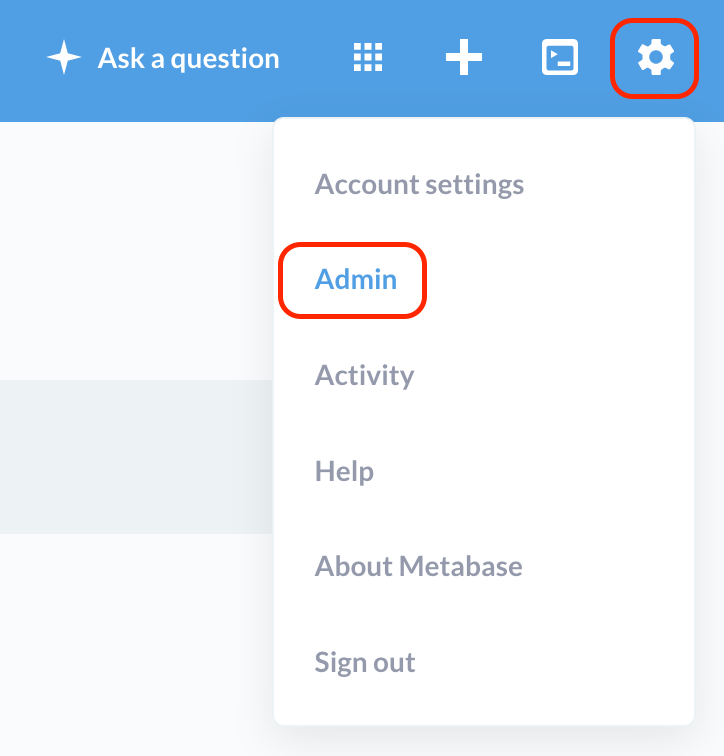
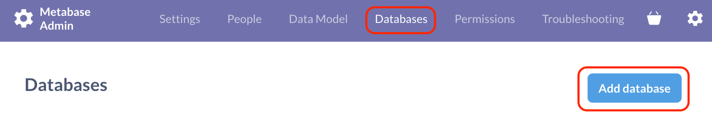
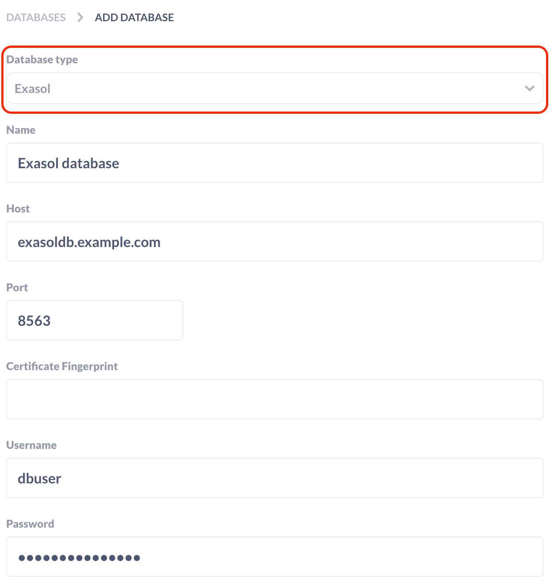

# User Guide

To use the Exasol driver for Metabase please first follow the [Metabase installation guide](https://www.metabase.com/docs/latest/operations-guide/installing-metabase.html) to download and install Metabase.

## Installing the Driver

We assume that you installed the Metabase JAR file `metabase.jar` to directory `$METABASE_DIR`. Plugins are then located in the same directory under `./plugins`: `$METABASE_DIR/plugins`.

Also see the [Metabase documentation](https://www.metabase.com/docs/latest/developers-guide-drivers.html#how-to-use-a-community-built-driver) about installing community plugins.

To install the Exasol driver follow these steps:

1. Download the latest Exasol JDBC driver for your operating system from the [Exasol download page](https://www.exasol.com/portal/display/DOWNLOAD/).
2. Copy the Exasol JDBC driver `exajdbc.jar` to `$METABASE_DIR/plugins`.
3. Download the latest Exasol Metabase driver from the [GitHub release page](https://github.com/exasol/metabase-driver/releases).
4. Copy the Exasol Metabase driver `exasol.metabase-driver_<version>.jar` to `$METABASE_DIR/plugins`.
5. Restart the Metabase server.

### Upgrading the Driver

To upgrade the Exasol driver or the Exasol JDBC driver, follow these steps:

1. Delete the old JAR file(s) from `$METABASE_DIR/plugins`
2. Copy the new JAR file(s) to `$METABASE_DIR/plugins`
3. Restart the Metabase server.

## Connect to Exasol

After you have installed the driver, create a new connection to your Exasol database.

1. Start the Metabase administration
    
2. Select the "Databases" section and click on "Add Database"
    
3. Select "Exasol" from the "Database type" drop down list and fill out the connection details:
  * Name: Name of the database connection in Metabase
  * Host: Hostname of your Exasol database
  * Port: Port number of your Exasol database, default: `8563`
  * Certificate Fingerprint: If your Exasol database uses a self-signed certificate, enter the certificate's checksum.
  * Username: Name of the database user
  * Password: Password of the database user
    
4. Click the "Save" button at the bottom of the page to verify and save the database connection.

### Connecting Through an SSH Tunnel

You can optionally connect to Exasol through an SSH tunnel by activating the "Use an SSH-tunnel for database connections" option on the Database page. Then enter the details for the SSH connection.

**Note:** We recommend to avoid connecting through an SSH tunnel if possible because it affects the performance.

See the [Metabase documentation about SSH tunnels](https://www.metabase.com/docs/latest/administration-guide/ssh-tunnel-for-database-connections.html) for details.

## Timestamps and Time Zone

Exasol has two data types for representing date and time: `TIMESTAMP` and `TIMESTAMP WITH LOCAL TIME ZONE`, see the [documentation about Exasol's date/time data types](https://docs.exasol.com/sql_references/data_types/datatypedetails.htm#DateTimeDataTypes) for details.

Metabase will show data from `TIMESTAMP` columns 'as is', i.e. the same value as stored in the database. You can imagine the value just like a string. It's not influenced by any timezone settings. 

Values from a `TIMESTAMP WITH LOCAL TIME ZONE` column will be displayed in the *Report Timezone* configured in Matabase's Localization Settings. If *Report Timezone* is set to the default (*Database Default*), Metabase will use Exasol's default timezone. The default timezone in Exasol can be defined by running

```sql
ALTER SYSTEM SET TIME_ZONE = 'America/New_York';
```

See the [ALTER SYSTEM documentation](https://docs.exasol.com/sql/alter_system.htm) for details.

**Example:**
Inserting the value `'2021-01-31 08:15:30.123'` (in UTC) into a column will display the following values (depending on the configured date format):

| Metabase *Report Timezone* | Displayed value `TIMESTAMP` | Displayed value `TIMESTAMP WITH LOCAL TIME ZONE` |
|----------------------------|-----------------------------|--------------------------------------------------|
| Database Default           | January 31, 2021, 08:15     | (depends on default timezone)                    |
| America/New_York           | January 31, 2021, 08:15     | January 31, 2021, 03:15                          |
| Europe/Berlin              | January 31, 2021, 08:15     | January 31, 2021, 09:15                          |

To ensure consistent behavior we recommend the following:

* Run SQL command

    ```sql
    ALTER SESSION SET TIME_ZONE = 'UTC';
    ```

    before inserting into `TIMESTAMP WITH LOCAL TIME ZONE` columns and using only timestamps in UTC timezone. This ensures that the database contains the correct values.
* Set the *Report Timezone* in Metabase to the user's timezone. This avoids issues caused by different configuration in the Exasol database.

For further information see the Metabase documentation about [handling timezones](https://www.metabase.com/docs/latest/operations-guide/handling-timezones.html) and the [date and time troubleshooting guide](https://www.metabase.com/docs/latest/troubleshooting-guide/timezones.html).

## Known Issues

### Using Tables with Self-Referencing Foreign Keys

When selecting data from a table with a self-referencing foreign key the query may fail with an error similar to

```
java.sql.SQLException: identifier <table>.<column> is ambiguous.
```

This is a known issue in Metabase. See [this ticket](https://github.com/exasol/metabase-driver/issues/12) for details.

### Timestamp and Timezone

Queries involving `TIMESTAMP WITH TIMEZONE` columns my return wrong results depending on the timezone set for the session. See [this ticket](https://github.com/exasol/metabase-driver/issues/9) for details.

### Scanning field values logs an exception for `GEOMETRY` columns

When Metabase scans field values of a table with a GEOMETRY column (e.g. when you click the "Re-scan field values now" button on the Database page) it logs the following exception:

```
2022-01-17 09:01:18,009 ERROR models.field-values :: Error fetching field values
clojure.lang.ExceptionInfo: Error executing query {:sql "-- Metabase\nSELECT \"META\".\"DATA_TYPES\".\"GEO\" AS \"GEO\" FROM \"META\".\"DATA_TYPES\" GROUP BY \"META\".\"DATA_TYPES\".\"GEO\" ORDER BY \"META\".\"DATA_TYPES\".\"GEO\" ASC LIMIT 5000", :params nil, :type :invalid-query}
...
Caused by: java.sql.SQLException: Feature not supported: GEOMETRY type in GROUP BY (Session: 1722185677957169152)
...
```

There seem to be no consequences of this error, everything seems to work fine.

See issue [#20](https://github.com/exasol/metabase-driver/issues/20) for details and a workaround for avoiding this error message.

## Troubleshooting

### Getting the Driver Version

The Exasol driver will log it's version and the Exasol JDBC driver's version when it is first used. You can trigger this the following way:

1. Stop Metabase and start it again
2. Login to Metabase and go to Settings > Admin
3. Go to Databases > your Exasol Database
4. Click the "Save changes" button without changing any setting

This will load the Exasol driver and print a message like this to the log:

```
2022-01-18 10:55:38,634 INFO driver.exasol :: Loading Exasol Metabase driver 0.2.0, Exasol JDBC driver: 7.1.4
```

### Exasol Driver Not Available

If Database Type "Exasol" is not availabe in the "Add Database" dialog and Metabase logs the following message at startup, the Exasol JDBC driver is not available.

```
INFO plugins.dependencies :: Metabase cannot initialize plugin Metabase Exasol Driver due to required dependencies. Metabase requires the Exasol JDBC driver in order to connect to Exasol databases, but we can't ship it as part of the driver due to licensing restrictions. See https://github.com/exasol/metabase-driver for more details.
````

Please download the latest Exasol JDBC driver from the [Exasol download page](https://www.exasol.com/portal/display/DOWNLOAD/) and copy `exajdbc.jar` to `$METABASE_DIR/plugins`.
